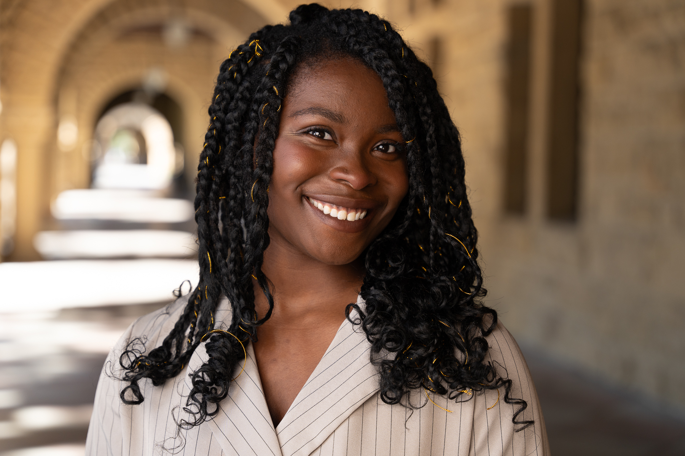

I’m a PhD candidate in Linguistics at Stanford University, co-advised by Dan Jurafsky and Rob Podesva. My research bridges sociolinguistics, computational linguistics, and psycholinguistics to explore how language encodes social meaning and shapes bias in both humans and AI systems.

My dissertation examines how linguistic variation among Black drivers in Oakland—particularly features of African American Language—affects police behavior during traffic stops. I’m supported by the NSF GRFP and Stanford’s DARE, RAISE, and HAI-TEP Fellowships. Beyond Stanford, I’ve interned at Google Research, IBM Research, and the Brookings Institution, conducting research on LLM neutrality evaluation, bias in generative and embedding models, and AI policy for low-resource languages.

## Research Activity
*Improving Neutral Point-of-View Generation with Data- and Parameter-Efficient RL* 
Jessica Hoffmann, Christiane Ahlheim, Zac Yu, Aria Walfrand, Jarvis Jin, **Marie Tano**, Ahmad Beirami, Erin van Liemt, Nithum Thain, Hakim Sidahmed, & Lucas Dixon 
EMNLP, 2025. [[preprint](https://arxiv.org/abs/2503.03654)]

July 2025: Shared dissertation progress on developing instruction-tuned autoregressive models to identify features of African American English (AAE) at the [Linguistics for Justice: Advancing Reforms in the Criminal Legal System](https://sites.google.com/view/linguisticsforjustice).

April 2025: Our paper received the [Richard Braddock Award for Best Article of the Year](https://cccc.ncte.org/cccc/awards/braddock) in College Composition and Communication (CCC).
